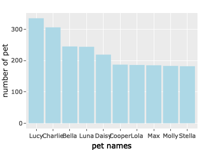

<!-- README.md is generated from README.Rmd. Please edit that file -->

# seattlepetname

<!-- badges: start -->
<!-- badges: end -->

The goal of `seattlepetname` is to allows users to understand the
preference of primary breeds and pet names of pet owners in Seattle. The
package also allows users to retrieve the distribution of licensed pet
in Seattle according to zip code districts.

## Installation

Users can install the `seattlepetname` from
[GitHub](https://github.com/) with:

``` r
# install.packages("devtools")
devtools::install_github("etc5523-2022/rpkg-Yan-Chui-Lucia-Cheung")
```

## Example

These are the example of how to use these functions:

``` r

library(seattlepetname)
```

1.  The preference of primary breeds of pet owners in Seattle

By entering the primary breeds in `max_pribreed()` function, a data
frame with the 5 zip code districts that have the highest number of a
particular primary breed will be returned.

``` r

max_pribreed("Old English Sheepdog")
#> Rows: 52519 Columns: 7
#> ── Column specification ────────────────────────────────────────────────────────
#> Delimiter: ","
#> chr (7): license_issue_date, license_number, animals_name, species, primary_...
#> 
#> ℹ Use `spec()` to retrieve the full column specification for this data.
#> ℹ Specify the column types or set `show_col_types = FALSE` to quiet this message.
#> # A tibble: 5 × 2
#>   zip_code count
#>      <int> <int>
#> 1    98115     7
#> 2    98118     7
#> 3    98105     6
#> 4    98199     6
#> 5    98136     5
```

2.  The zip code that has the **highest number of licensed pets** of a
    particular year

By entering the year in `zipcode_max()` function, a data frame with the
zip code districts that have the highest number of licensed pets
overall. The following example used year 2018 for demonstration.

``` r

zipcode_max("2018")
#> Rows: 52519 Columns: 7
#> ── Column specification ────────────────────────────────────────────────────────
#> Delimiter: ","
#> chr (7): license_issue_date, license_number, animals_name, species, primary_...
#> 
#> ℹ Use `spec()` to retrieve the full column specification for this data.
#> ℹ Specify the column types or set `show_col_types = FALSE` to quiet this message.
#> # A tibble: 1 × 3
#> # Groups:   year [1]
#>    year zip_code     n
#>   <dbl>    <int> <int>
#> 1  2018    98115  2944
```

3.  The zip code that has the **lowest number of licensed pets** of a
    particular year

By entering the year in `zipcode_min()` function, a data frame with the
zip code districts that have the lowest number of licensed pets overall.

``` r

zipcode_min("2018")
#> Rows: 52519 Columns: 7
#> ── Column specification ────────────────────────────────────────────────────────
#> Delimiter: ","
#> chr (7): license_issue_date, license_number, animals_name, species, primary_...
#> 
#> ℹ Use `spec()` to retrieve the full column specification for this data.
#> ℹ Specify the column types or set `show_col_types = FALSE` to quiet this message.
#> # A tibble: 1 × 3
#> # Groups:   year [1]
#>    year zip_code     n
#>   <dbl>    <int> <int>
#> 1  2018     9811     1
```

4.  The top 5 pet name of a particular year

By entering pet names and year in `name_of_the_year()` function, a data
frame with the top 5 popular names and the respective count of a
particular year will be returned.

``` r

name_of_the_year("Silas", "2018") #When the name is not on the top 5 list
#> Rows: 52519 Columns: 7
#> ── Column specification ────────────────────────────────────────────────────────
#> Delimiter: ","
#> chr (7): license_issue_date, license_number, animals_name, species, primary_...
#> 
#> ℹ Use `spec()` to retrieve the full column specification for this data.
#> ℹ Specify the column types or set `show_col_types = FALSE` to quiet this message.
#> [1] "This is not a popular name of this year!"
```

``` r

name_of_the_year("Lucy", "2018") #When the name is on the top 5 list
#> Rows: 52519 Columns: 7
#> ── Column specification ────────────────────────────────────────────────────────
#> Delimiter: ","
#> chr (7): license_issue_date, license_number, animals_name, species, primary_...
#> 
#> ℹ Use `spec()` to retrieve the full column specification for this data.
#> ℹ Specify the column types or set `show_col_types = FALSE` to quiet this message.
#> [1] "This is a popular name of this year!"
#> # A tibble: 5 × 3
#> # Groups:   year, animals_name [5]
#>    year animals_name     n
#>   <dbl> <chr>        <int>
#> 1  2018 Lucy           271
#> 2  2018 Charlie        245
#> 3  2018 Luna           238
#> 4  2018 Bella          207
#> 5  2018 Max            176
```

5.  The number summary of pet distribution in each year

By entering the year in `pet_summary()` function, a data frame with the
mean, median, standard deviation and the number of zip code recorded of
a particular year will be returned.

``` r

pet_summary("2018")
#> Rows: 52519 Columns: 7
#> ── Column specification ────────────────────────────────────────────────────────
#> Delimiter: ","
#> chr (7): license_issue_date, license_number, animals_name, species, primary_...
#> 
#> ℹ Use `spec()` to retrieve the full column specification for this data.
#> ℹ Specify the column types or set `show_col_types = FALSE` to quiet this message.
#> # A tibble: 1 × 5
#>    year  mean median    sd zipcode_count
#>   <dbl> <dbl>  <dbl> <dbl>         <int>
#> 1  2018  361.    2.5  679.            92
```

6.  The top 10 popular pet name (by species) in Seattle

By entering the species in `top_name()` function, a plot that shows the
top 10 popular name of a particular species will be returned.

``` r

top_name("Dog") 
#> Rows: 52519 Columns: 7
#> ── Column specification ────────────────────────────────────────────────────────
#> Delimiter: ","
#> chr (7): license_issue_date, license_number, animals_name, species, primary_...
#> 
#> ℹ Use `spec()` to retrieve the full column specification for this data.
#> ℹ Specify the column types or set `show_col_types = FALSE` to quiet this message.
```


Testing
